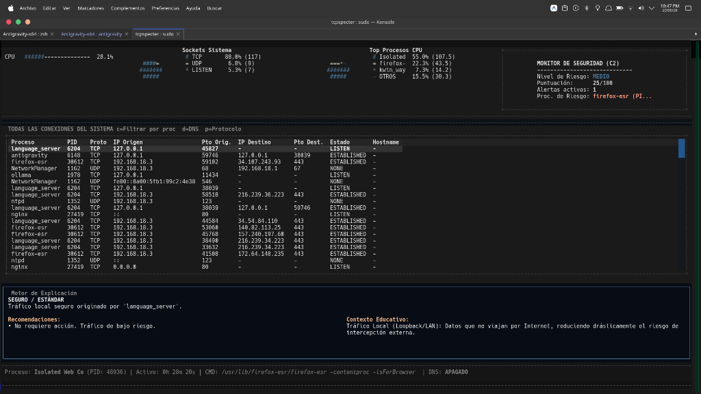
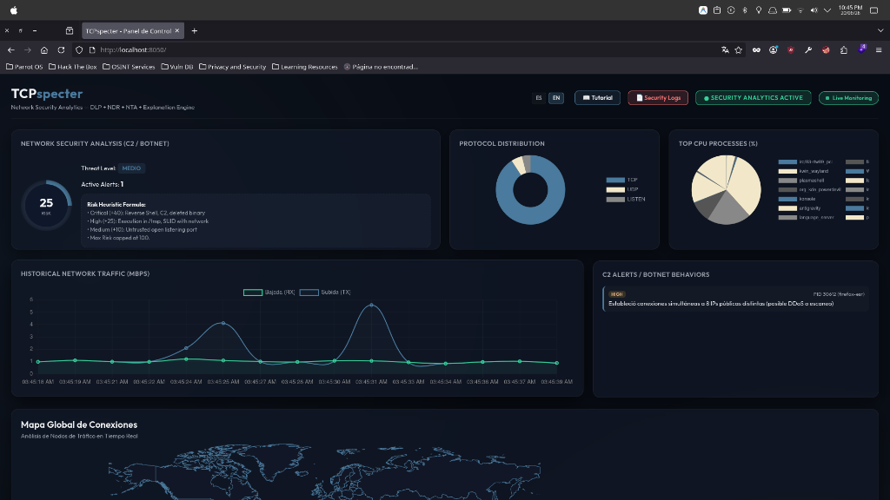
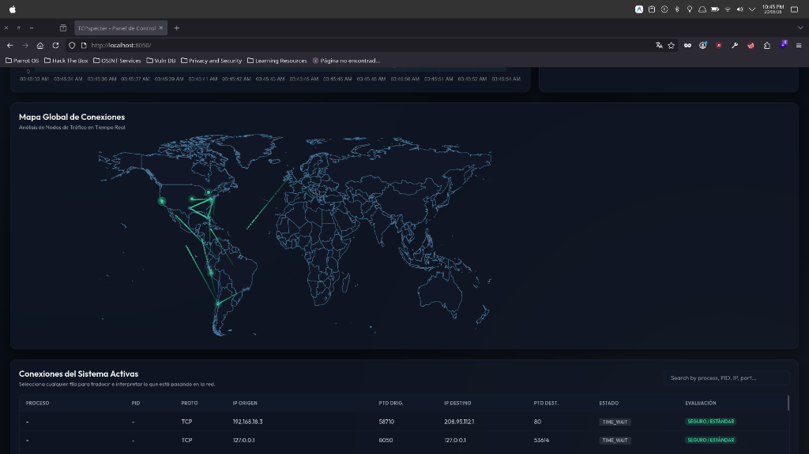

# TCPspecter

**TCPspecter** is an enterprise-grade Network Traffic Analysis (NTA), Network Detection & Response (NDR), and real-time process forensics platform written in Python 3.11+ for GNU/Linux systems (Debian, Ubuntu, Kali, Parrot Security OS, CentOS and derivatives). Inspired by Sysinternals' TCPView for Windows, it combines deep packet inspection, memory forensics, and an active SOAR response engine — all accessible from both an interactive terminal (TUI) and a full-featured web dashboard.

---

## 📸 Screenshots

### 💻 Terminal Interface (TUI)
Premium ASCII TUI with real-time performance graphs, socket distribution analysis, and heuristic zombie scanning:



### 🌐 Web Dashboard (Glassmorphic Dark)
Interactive web control panel accessible in your local browser at `http://localhost:8050`:



### 🗺️ Geographic Map & Traceroute
Dynamic geographic visualization of active IP connections and network hops rendered with Apache ECharts:



---

## Architecture: Decoupled Alert Bus

TCPspecter is not a passive sniffer. At its core is an **asynchronous, decoupled Alert Bus** that separates detection engines from UI and persistence layers — a design pattern inspired by production-grade SIEM architectures.

```text
  [Snort IDS]  ──┐
  [Scapy DPI]  ──┼──→ alerts.publish() ──→ [ Alert Bus (Queue) ] ──→ [ Web Dashboard / TUI ]
  [Proc Maps]  ──┘                                  │
                                                    ├──→ ECS JSON → security_alerts.json
                                                    ├──→ Text Log → security_events.log
                                                    └──→ HMAC-Signed Webhooks (SOAR)
```

**Key Architectural Properties:**
1. **No circular imports** — Detection engines (`zombie_detector`, `scapy_engine`, `snort_manager`) only call `alerts.publish()`. They have zero knowledge of the web server or TUI.
2. **ECS v1.12 compliance** — Every `SecurityAlert` is serialized to Elastic Common Schema JSON, making logs immediately ingestible by Wazuh, Splunk, or ELK without custom parsers.
3. **Compliance tagging** — Each alert carries embedded NIST CSF (e.g., `DE.CM-7`, `PR.DS-5`) and ISO/IEC 27001 control tags (e.g., `A.12.6.1`, `A.13.1.1`) for continuous compliance auditing.

---

## Core Features

### 🔍 Detection Engines

| Feature | Description | MITRE ATT&CK |
|---------|-------------|--------------|
| **Fileless Memory Scanner** | Scans `/proc/<pid>/maps` for anonymous executable segments missing a file backing — detects shellcode injection and process hollowing | T1055 |
| **C2 Beaconing Detector** | Analyzes the coefficient of variation of per-PID outbound connection intervals to flag statistically regular C2 heartbeats | T1071.001 |
| **DNS Tunneling Heuristics** | Deep packet inspection of DNS queries measuring Shannon entropy and abnormal query lengths using Scapy | T1048.003 |
| **Zombie Process Detector** | Identifies processes executing from suspicious paths (`/tmp`, `/dev/shm`), deleted binaries, or SUID binaries with active network sockets | T1059, T1070.004 |
| **Process Masquerading** | Detects processes mimicking legitimate system service names while running from non-standard paths | T1036.005 |
| **Mass Connection Scan** | Flags processes opening abnormal numbers of concurrent outbound connections (with a whitelist for browsers, dev tools) | T1046 |

### 🛡️ Response Engine (SOAR)

| Feature | Description |
|---------|-------------|
| **Quick Block / Rule Builder** | Web UI and TUI-based IP blocking via `iptables` or `ufw` (auto-detected) with strict IPv4 input sanitization |
| **Host Quarantine** | Full host isolation using custom `iptables` chains (`TCPSPECTER-Q-IN` / `TCPSPECTER-Q-OUT`) preserving only loopback and analyst IP access |
| **Deception Tarpitting** | PREROUTING DNAT to redirect attacking IPs to a slow-response Tarpit server (`core/tarpit.py`) that responds at 1 byte/15s to exhaust scanners |
| **HMAC-Signed Webhooks** | Signed HTTP POST payloads (HMAC-SHA256 via `X-TCPspecter-Signature` header) to external SOAR platforms |

### 🔐 Web Security
- Single-use CSRF tokens (30-minute TTL, per-client)
- Rate limiting: 30 mutating requests/minute/IP
- Strict HTTP security headers (CSP, X-Frame-Options, HSTS)
- All firewall IPs validated with Python `ipaddress` module before any syscall

---

## Quick Start

### Prerequisites
- Python 3.11+
- Linux system (any modern distro)
- Terminal with minimum 80×24 characters
- `python3-venv` package installed
- **Root privileges** (`sudo`) — required for raw sockets, `/proc` access, and `iptables`

### Installation & Run

```bash
# Clone the repository
git clone https://github.com/your-org/tcpspecter.git
cd tcpspecter

# Make the launcher executable
chmod +x run.sh

# Run (will prompt to elevate to root if needed)
./run.sh
```

`run.sh` automatically creates a Python virtual environment, installs all dependencies from `requirements.txt`, and launches the application.

### Web Dashboard
Once running, open your browser to:
```
http://localhost:8050
```

---

## Configuration (`config.json`)

Edit the `config.json` file in the project root to customize behavior:

```json
{
  "virustotal_api_key": "",
  "ACTIVE_RESPONSE_ENABLED": false,
  "MANAGEMENT_IP_WHITELIST": ["127.0.0.0/8", "10.0.0.0/8", "172.16.0.0/12", "192.168.0.0/16"],
  "SOAR_WEBHOOK_URL": "",
  "TARPIT_PORT": 2222,
  "web_server_port": 8050,
  "webhook_url": "",
  "webhook_secret": ""
}
```

| Key | Type | Default | Description |
|-----|------|---------|-------------|
| `ACTIVE_RESPONSE_ENABLED` | bool | `false` | Master switch for automated blocking. `false` = audit mode only |
| `MANAGEMENT_IP_WHITELIST` | list | RFC 1918 ranges | IPs never blocked by automated response |
| `webhook_url` | string | `""` | HTTP POST endpoint for HMAC-signed alert forwarding |
| `webhook_secret` | string | `""` | Shared secret for `X-TCPspecter-Signature` HMAC-SHA256 signing |
| `virustotal_api_key` | string | `""` | API key for VirusTotal binary reputation lookups (TUI `v` key) |
| `TARPIT_PORT` | int | `2222` | Local port used by the Tarpit deception server |
| `web_server_port` | int | `8050` | Web dashboard listening port |

> ⚠️ **`ACTIVE_RESPONSE_ENABLED = false` by default.** Never enable automated blocking before profiling your network baseline. Start in audit mode.

---

## TUI Keyboard Reference

| Key | Action | Description |
|:----|:-------|:------------|
| `↑` / `k` | Cursor Up | Move selection up in active table |
| `↓` / `j` | Cursor Down | Move selection down in active table |
| `TAB` | Switch Focus | Toggle focus between interface panels |
| `a` | Analyze (Local) | Offline binary analysis: SUID bits, hashes, permissions |
| `v` | VirusTotal | Live reputation lookup via VirusTotal API |
| `x` | Kill Process | Terminate selected PID (with confirmation prompt) |
| `d` | Resolve DNS | Toggle background reverse DNS resolution |
| `/` | Filter | Real-time search bar (IP, port, PID, process name) |
| `p` | Protocol Filter | Cycle: `ALL` → `TCP` → `UDP` → `LISTEN` |
| `s` | Sort Column | Change sort column for the active connections table |
| `e` | Export Report | Generate CSV or JSON system report |
| `z` | Zombie Scan | Run full heuristic audit (C2, Zombie, fileless) |
| `c` | View Toggle | All connections ↔ process-specific connections |
| `m` | Global Map | Open geographic connections map in browser |
| `g` | Charts (TUI) | Open embedded local charts modal in terminal |
| `Shift+G` | Charts (Browser) | Open web dashboard in browser |
| `i` | Interpret | Open Explanation Engine for human-language socket translation |
| `S` | Toggle Analytics | Enable/disable advanced security heuristics live |
| `f` | Firewall Panel | Open firewall control panel and active rule overview |
| `t` | Toggle Snort | Start/stop passive Snort IDS service |
| `b` | Block IP | Block the selected connection's external IP in iptables/ufw |
| `ESC` | Cancel/Close | Close dialogs, modals, or active search bar |
| `q` | Quit | Gracefully shut down all processes and release sockets |

---

## Web Dashboard Navigation

Access the SPA at `http://localhost:8050` — multiple views available via the top navigation bar:

| Route | Description |
|-------|-------------|
| `/` | Main Dashboard: Risk score, protocol charts, alerts, active connections, geo map |
| `/firewall` | Firewall & IDS: Rule Builder, active iptables/ufw policies, Snort status |
| `/logs` | Security Log Viewer: Parsed `security_events.log` timeline |
| `/configuration` | Settings: Language toggle (EN/ES), tutorial link |

---

## Documentation

Full documentation is in the [`docs/`](docs/) directory, organized as follows:

```
docs/
├── 1_getting_started/
│   ├── architecture.md          # Alert Bus design, engine descriptions
│   ├── installation.md          # Full installation guide
│   └── configuration.md         # config.json reference
├── 2_user_manual/
│   ├── tui_navigation.md        # Complete TUI keyboard map and panel guide
│   └── web_dashboard.md         # Web SPA views, XAI modal, Rule Builder
├── 3_incident_response_playbooks/
│   ├── playbook_dns_tunneling.md    # IR: DNS Tunneling / Data Exfiltration
│   ├── playbook_c2_beaconing.md     # IR: Command & Control Beaconing
│   └── playbook_fileless_malware.md # IR: Fileless Memory Injection
├── 4_active_response_soar/
│   ├── automated_mitigation.md  # Quarantine chains, Tarpit, SOAR flow
│   └── custom_webhooks.md       # HMAC webhook integration
└── 5_compliance_and_rules/
    ├── ecs_mapping.md           # ECS v1.12 field mapping table
    └── mitre_attack.md          # MITRE ATT&CK coverage matrix
```

---

## Security & Legal Notice

TCPspecter is designed exclusively as a **defensive Blue Team tool**. It requires root access and should only be deployed on systems you own or have explicit authorization to monitor. Unauthorized interception of network traffic may be illegal in your jurisdiction.

---

## License

MIT License — see [LICENSE](LICENSE) for details.
